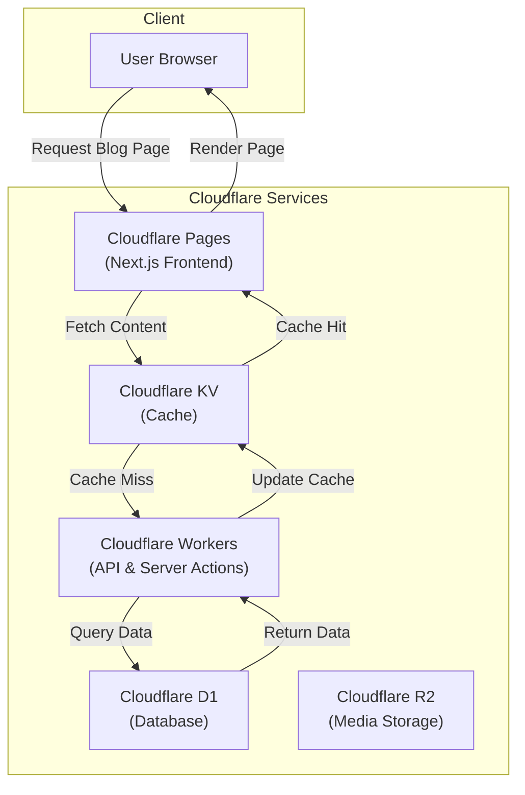

# Blog CMS Implementation Guide

A Next.js-based CMS leveraging Cloudflare's ecosystem (Pages, Workers, D1, R2, KV) for a personal blog platform.

## Architecture Overview

### Core Components

- **Frontend:** Next.js 14+ app router with TypeScript & Tailwind CSS
- **Backend Services:** Cloudflare Workers for API/server actions
- **Data Layer:**
  - Cloudflare D1 (SQL) for structured data
  - R2 for media storage
  - KV for performance caching
- **Auth:** Clerk for admin authentication

### System Diagram



## Getting Started

### Prerequisites

```bash
# Install dependencies
npm install

# Configure Cloudflare CLI
npm install -g wrangler

# Login to Cloudflare
wrangler login

# Initialize D1 database
wrangler d1 create blog-cms
```

### Environment Setup

Create `.env.local`:

```env
# Cloudflare
CLOUDFLARE_ACCOUNT_ID=your_account_id
D1_DATABASE_NAME=blog-cms
R2_BUCKET_NAME=blog-media
KV_NAMESPACE_ID=blog-cache

# Clerk Auth
NEXT_PUBLIC_CLERK_PUBLISHABLE_KEY=pk_****
CLERK_SECRET_KEY=sk_****
```

### Database Schema

Run these migrations via wrangler:

```sql
-- posts table
CREATE TABLE posts (
    id TEXT PRIMARY KEY,
    title TEXT NOT NULL,
    slug TEXT UNIQUE NOT NULL,
    status TEXT CHECK(status IN ('draft', 'published', 'archived')) NOT NULL,
    content TEXT,
    excerpt TEXT,
    categories TEXT,
    metadata TEXT,
    author_id TEXT NOT NULL,
    created_at TEXT NOT NULL,
    updated_at TEXT NOT NULL
);

-- categories table
CREATE TABLE categories (
    id TEXT PRIMARY KEY,
    name TEXT NOT NULL,
    slug TEXT UNIQUE NOT NULL,
    description TEXT
);

-- indexes
CREATE INDEX idx_posts_slug ON posts(slug);
CREATE INDEX idx_posts_status ON posts(status);
```

## Development Workflow

### Local Development

```bash
# Start Next.js dev server
npm run dev

# Start Cloudflare Workers dev environment
npm run dev:worker
```

### Key API Routes

All routes are implemented as Cloudflare Workers:

```typescript
// app/api/posts/route.ts
export async function GET(req: Request) {
  const { searchParams } = new URL(req.url);
  const status = searchParams.get("status") || "published";

  const posts = await env.DB.prepare("SELECT * FROM posts WHERE status = ?")
    .bind(status)
    .all();

  return Response.json(posts);
}
```

### Server Actions

Example of a post creation action:

```typescript
// app/actions/posts.ts
"use server";

export async function createPost(data: PostInput) {
  const { title, content } = data;
  const slug = generateSlug(title);

  // Insert into D1
  await env.DB.prepare(
    `
    INSERT INTO posts (id, title, slug, status, content, created_at, updated_at)
    VALUES (?, ?, ?, 'draft', ?, datetime(), datetime())
  `
  )
    .bind(crypto.randomUUID(), title, slug, content)
    .run();

  // Invalidate KV cache
  await env.KV.delete(`posts:${slug}`);

  revalidatePath("/blog");
}
```

### Caching Strategy

Implement caching using KV:

```typescript
// utils/cache.ts
export async function getCachedPost(slug: string) {
  // Try KV first
  const cached = await env.KV.get(`posts:${slug}`);
  if (cached) return JSON.parse(cached);

  // Fallback to D1
  const post = await env.DB.prepare(
    "SELECT * FROM posts WHERE slug = ? AND status = ?"
  )
    .bind(slug, "published")
    .first();

  if (post) {
    // Cache for 1 hour
    await env.KV.put(`posts:${slug}`, JSON.stringify(post), {
      expirationTtl: 3600,
    });
  }

  return post;
}
```

## Media Handling

### R2 Upload Implementation

```typescript
// app/api/upload/route.ts
export async function POST(req: Request) {
  const formData = await req.formData();
  const file = formData.get("file") as File;

  const key = `${crypto.randomUUID()}-${file.name}`;
  await env.BUCKET.put(key, file);

  const url = env.BUCKET.publicUrl(key);
  return Response.json({ url });
}
```

## Authentication

### Clerk Integration

```typescript
// middleware.ts
import { authMiddleware } from "@clerk/nextjs";

export default authMiddleware({
  publicRoutes: ["/", "/blog(.*)"],
  ignoredRoutes: ["/api/public(.*)"],
});

export const config = {
  matcher: ["/((?!.+\\.[\\w]+$|_next).*)", "/", "/(api|trpc)(.*)"],
};
```

## Deployment

### Configuration

Create `wrangler.toml`:

```toml
name = "blog-cms"
main = "src/worker.ts"

[[d1_databases]]
binding = "DB"
database_name = "blog-cms"
database_id = "your-d1-id"

[[r2_buckets]]
binding = "BUCKET"
bucket_name = "blog-media"

[[kv_namespaces]]
binding = "KV"
id = "your-kv-id"
```

### Deploy Commands

```bash
# Deploy Next.js to Cloudflare Pages
npm run deploy

# Deploy Workers
npm run deploy:worker

# Deploy D1 migrations
wrangler d1 migrations apply blog-cms
```

## Performance Monitoring

### Key Metrics to Watch

- Worker execution times
- D1 query performance
- R2 storage usage
- KV hit rates

Monitor via Cloudflare Dashboard or implement custom logging.

## Testing

### Unit Tests

```typescript
// tests/api/posts.test.ts
import { describe, expect, it } from "vitest";
import { createPost } from "@/app/actions/posts";

describe("Post Actions", () => {
  it("creates a post in draft status", async () => {
    const post = await createPost({
      title: "Test Post",
      content: "Content",
    });

    expect(post.status).toBe("draft");
    expect(post.slug).toMatch(/test-post/);
  });
});
```

## Common Issues & Solutions

### Troubleshooting

1. **Cache Invalidation:** Use `revalidatePath()` after updates
2. **Worker Timeouts:** Keep functions under 30sec execution limit
3. **D1 Connections:** Always use prepared statements
4. **R2 URLs:** Remember to configure CORS for media access

## Contributing

### Development Guidelines

1. Use TypeScript strictly - no `any` types
2. Follow Next.js app router patterns
3. Implement proper error boundaries
4. Add JSDoc comments for complex functions

### PR Process

1. Branch naming: `feature/`, `fix/`, `chore/`
2. Required tests for new features
3. Update documentation as needed
4. Squash commits when merging
